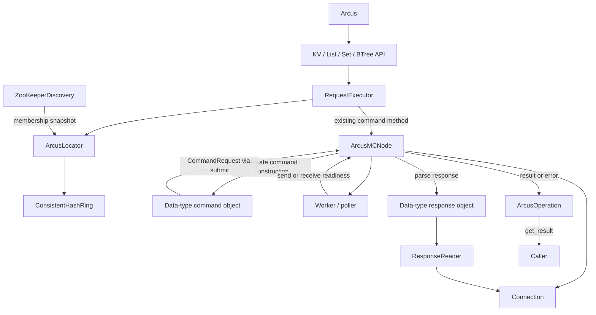

# Object responsibilities and collaboration

The public `Arcus` facade composes data-type APIs. Each node composes command and
response objects around one transport. Components communicate through explicit
method calls, immutable command messages, membership callbacks and asynchronous
operation results. There are no command mixins, dynamic method forwarding or
new cache commands.

## Responsibilities

| Object | Owns | Collaborates through |
| --- | --- | --- |
| `Arcus` | Existing public method signatures and collection-wrapper access | Four API objects and the locator lifecycle |
| `KeyValueAPI`, `ListAPI`, `SetAPI`, `BTreeAPI` | Data-type API dispatch; BTree multi-node result assembly | Shared `RequestExecutor` and existing node command methods |
| `RequestExecutor` | Destination lookup and key grouping | `ArcusLocator.get_node()` and an explicit node operation callable |
| `ZooKeeperDiscovery` | ZooKeeper connection, watches, session recovery, snapshot ordering and startup deadline | A callback carrying a list of member names |
| `ConsistentHashRing` | Hash points, node allocation/reuse/retirement and key placement | Node allocator; no ZooKeeper dependency |
| `ArcusLocator` | Discovery/ring composition and synchronized client lifecycle | Discovery, ring and allocator |
| `KVCommands`, `ListCommands`, `SetCommands`, `BTreeCommands`, `AdminCommands` | Command bytes and selection of the response parser | Codec, shared collection builder and `CommandSubmitter.submit()` |
| `CommandRequest` | Immutable command name, payload, parser callback and reply mode | Passed from commands to transport |
| `ArcusMCNode` | Connection lifetime, queue ordering, deadlines and operation completion/failure | Connection, worker/poller and response callback |
| Response objects | Family-specific result shapes and protocol errors | `ResponseReader`; no node, worker or queue reference |
| `ResponseReader` | Reading framed bytes and decoding values | Connection read methods and transcoder |
| `ArcusOperation` / `ArcusOperationList` | Waiting, cached results/errors and multi-node aggregation | Callers and completion notifications |

The shared collection builder constructs common wire options without submitting
requests. `CollectionResponses` reads common collection framing; List, Set and
BTree response objects own their result containers and element interpretation.
`CommandHandlers` and `ResponseHandlers` are composition helpers for a node.

## A get request and its response

1. `Arcus.get(key)` delegates to `KeyValueAPI`. Its shared executor resolves the
   key through the locator and invokes the selected node's compatible `get()`.
2. The node delegates command construction to `KVCommands`. That object produces
   a frozen `CommandRequest` containing the wire bytes and `KVResponses.value`
   callback. It knows only the submit capability, codec and response handlers.
3. `ArcusMCNode.submit()` creates an operation and registers its generation,
   deadline and response slot under the existing transport locks. The exact
   operation is returned through the API to the caller.
4. The worker sends the operation through the connection. The poller signals
   read readiness; the node invokes the parser while holding its I/O lock and
   applying the operation's remaining read deadline.
5. The parser uses the reader and transcoder to return a Python value. The node
   completes the operation, waking callers in `get_result()`. Transport/protocol
   failures close the connection and resolve affected pending operations using
   the existing error policy.

BTree mget/smget use the same per-node flow. `BTreeAPI` asks the executor to group
keys by node, submits each group, and returns `ArcusOperationList`. Group order,
missed-key reporting and result merging retain their existing behavior.

## State ownership and locking

- Commands never access sockets, queues, connection generations or locks.
- Response objects do not close connections or complete operations. They return
  values or raise errors; the node owns transport recovery and completion.
- A node reuses its collaborators because parser state is local to each call.
  Its I/O lock serializes response reading and connection changes.
- Discovery performs only asynchronous refresh requests on Kazoo callbacks.
  It orders snapshots before invoking the membership callback; no blocking
  ZooKeeper request holds the routing lock.
- Discovery publication can acquire the locator's routing lock. Locator cleanup
  releases that lock before closing discovery, preserving one-way lock ordering.
- The ring publishes a new node set only after allocation succeeds. The locator
  synchronizes ring access and coordinates cleanup after disconnect or setup failure.

## Compatibility and limits

Existing imports, `Arcus`/`ArcusMCNode` method signatures, key placement and normal
asynchronous result contracts are preserved. `client.locator` remains replaceable.
The existing List/Set Python wrappers still refer to the same public client.
Map commands are not implemented and were not added in this refactor.

Discovery/ring state is now owned by its collaborators. `locator.zk`,
`locator.node_list` and `locator.addr_node_map` expose read views; replacing those
attributes directly is not supported. Node connections and transcoders are wired
into collaborators at construction. Replacing `node.handle` or `node.transcoder`
afterward is not a supported reconfiguration mechanism. Reconnecting through the
normal lifecycle continues to use the same connection object and a new socket.

Focused regressions found and corrected three existing command paths while moving
their implementations:

- `node.get_stats()` now returns an operation with the complete `dict[str, str]`
  response, consuming all STAT lines and END before the next queued reply.
- Set deletion separates the payload length from the `drop` option. Successful
  `DELETED_DROPPED` replies now return `True` through the shared deletion parser.
- Set existence with `pipe=True` no longer refers to an undefined `noreply`
  variable while constructing its command. This wire-construction correction
  does not establish complete end-to-end pipeline support.

Other existing protocol limitations remain, including line-oriented collection
payload parsing and unvalidated compression/custom-object serialization. The
transport still performs blocking response reads; this separation does not promise
strict latency bounds under arbitrary load or establish production readiness.

## Validation

`tests/test_command_contracts.py` checks exact command bytes, reply modes, callbacks
and compatibility delegates using a submit-only fake. `tests/test_responses.py`
feeds deterministic byte streams into standalone handlers. API tests cover routing,
grouping, signatures and unchanged operation identity; discovery tests exercise
ordering, session lifecycle and cleanup separately from hashing.

Existing connection, worker, result and deadline regressions remain in the suite.
The isolated Linux integration suite exercises the installed wheel against actual
Arcus and ZooKeeper; the separate stability runner covers failure and recovery.
See [validation scope](validation.md) for the distinction between these checks and
service-specific performance or long-duration acceptance.
